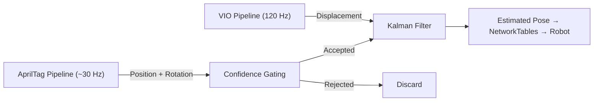

# AprilTag Tracking

QuestNav can use AprilTag fiducial markers placed around the FRC field to establish and correct the headset's absolute position on the field. This page provides a high-level overview. For in-depth details, see:

- [Coordinate Systems](./coordinate-systems) — All three coordinate systems, axis mappings, quaternion conventions, and the math behind each conversion
- [Detection Pipeline](./detection-pipeline) — Step-by-step walkthrough from camera capture through PnP solving to confidence metrics
- [Kalman Filter & Pose Estimation](./kalman-filter) — State model, prediction/correction math, two-phase gating derivations, latency compensation, and yaw correction
- [Field Layout & Native Interop](./field-layout-and-native-interop) — JSON field layouts, 3D corner computation, and native library (libapriltag, PoseLib, ntcore) architecture

:::info
AprilTag tracking is an **experimental feature** on the `SeanErn/AprilTag` branch. It augments the existing VIO-based tracking with field-relative position corrections.
:::

## Why AprilTags?

VIO alone provides smooth, high-rate (120 Hz) position tracking, but it has two limitations:

1. **No absolute position** — VIO tracks relative movement from wherever the headset started. It doesn't know where on the field it is.
2. **Drift** — Over time, small errors in VIO accumulate, causing the estimated position to slowly diverge from reality.

AprilTags solve both problems. When the headset sees AprilTags with known positions on the field, it can compute its absolute field position and correct VIO drift.

## High-Level Architecture

The system fuses two data sources using a Kalman filter:

- **VIO** (120 Hz): Smooth, relative position updates from the Quest headset's built-in tracking. Provides the "between-tag" dead reckoning.
- **AprilTag observations** (~30 Hz): Absolute position measurements from detecting field AprilTags. Provides corrections when tags are visible.



## Detection Pipeline

Each AprilTag detection cycle runs the following steps:

1. **Capture** — A grayscale frame is captured from the Quest headset's passthrough camera.
2. **Detect** — The native AprilTag library (libapriltag) scans the frame for tag36h11 markers and returns their 2D corner positions in the image.
3. **Solve** — If 2+ tags are detected, PoseLib (a multi-tag PnP solver) computes the camera's 3D pose relative to the known tag positions on the field.
4. **Convert** — The camera pose is converted from the Computer Vision coordinate system to the FRC field coordinate system.
5. **Gate** — Confidence metrics are evaluated to decide whether the observation is trustworthy enough to use.
6. **Correct** — If accepted, the observation is fed into the Kalman filter to correct position (and, during initial alignment, heading).

## Coordinate Systems

Three coordinate systems are involved:

| System | X | Y | Z | Handedness |
|--------|---|---|---|------------|
| **FRC Field** | Toward red alliance | Left | Up | Right-handed |
| **Unity World** | Right | Up | Forward | Left-handed |
| **Computer Vision** | Right | Down | Forward | Right-handed |

The field layout JSON (e.g., `2026-rebuilt-welded.json`) stores tag positions in **FRC field coordinates** with the origin at the blue alliance driver station corner. QuestNav's internal geometry library (`Pose3d`, `Translation3d`, `Rotation3d`) operates in FRC coordinates.

## Two-Phase Alignment

AprilTag corrections operate in two phases to prevent corrupted observations (reflections, partial occlusions) from ruining the pose estimate.

### Phase 1: Initial Alignment

Before any AprilTag has been accepted, the system runs on pure VIO in an arbitrary coordinate frame. The headset doesn't know where it is on the field or which direction it's facing.

The first observation that passes the minimum quality bar establishes the field alignment:

- **Minimum tags**: 2
- **Minimum inlier ratio**: 60%

When accepted, Phase 1:

1. **Sets the absolute position** directly from the AprilTag measurement (the Kalman filter state is hard-reset to the measured position)
2. **Computes the heading offset** between the AprilTag-measured heading and the VIO heading, so all future VIO data is rotated into the correct field frame
3. **Transitions to Phase 2** — the system is now aligned

:::tip
Phase 1 fires once and is designed to be lenient. Two tags with 60% inlier ratio is a low bar, allowing alignment to happen quickly after the headset first sees the field.
:::

### Phase 2: VIO-Primary with Selective Corrections

After alignment, VIO is the primary tracking source. AprilTag corrections are only applied when confidence is high:

- **Minimum tags**: 3
- **Minimum inlier ratio**: 80%
- **Maximum position jump**: 2.0 meters (observations further than this from the current estimate are rejected as likely reflections or misdetections)

The heading offset computed in Phase 1 is **locked** — VIO handles heading from then on. This prevents noisy AprilTag heading estimates from fighting the VIO's smooth rotation tracking.

:::note
The stricter Phase 2 thresholds mean that distant, noisy, or partially-occluded tag detections are automatically filtered out. This is intentional — VIO is more reliable than a low-confidence AprilTag measurement.
:::

## Confidence Metrics

Each AprilTag observation is evaluated using these signals:

| Metric | Source | Meaning |
|--------|--------|---------|
| **Inlier ratio** | PoseLib RANSAC | Fraction of 2D-3D point correspondences that fit the estimated pose. Higher = more consistent detection. |
| **Tag count** | AprilTag detector | Number of tags detected in the frame. More tags provide stronger geometric constraints. |
| **Position jump** | KF state vs. measurement | Distance between the measured position and the current estimate. A large jump signals a likely false detection. |

## Dynamic Measurement Noise

The Kalman filter's measurement noise (how much it trusts each AprilTag observation) is computed dynamically based on the observation quality:

```
linearStdDev = BASE_STD_DEV * (avgDistance² / tagCount)
```

- **Closer tags + more tags** = lower noise = stronger correction
- **Distant tags + fewer tags** = higher noise = weaker correction

This means a close-up view of many tags will snap the position confidently, while a distant glimpse of a few tags will only gently nudge the estimate.

## Field Layout

Tag positions are loaded from a JSON file in `StreamingAssets/apriltag/fieldlayouts/`. The default layout is `2026-rebuilt-welded.json`, which contains all 32 tag positions for the 2026 FRC field.

Each tag entry specifies:
- **ID** — The tag's numeric identifier
- **Pose** — The tag's position (x, y, z in meters) and orientation (quaternion) in FRC field coordinates

The tag size (the black square portion) is configured at startup (default: 0.1651m / 6.5 inches).

## Recenter Handling

Pressing and holding the Quest logo button triggers a tracking recenter, which redefines the VIO origin. QuestNav detects this via the `OVRManager.display.RecenteredPose` event and resets the VIO baseline without disturbing the Kalman filter state or field alignment. This means:

- The estimated field position is preserved
- The heading offset is preserved
- No position jump occurs after a recenter

## What Gets Published

The fused pose is published to NetworkTables at the VIO update rate (~120 Hz) as a `Pose3d` protobuf under `QuestNav/LatestRobotPose`. The pose contains:

- **Position** (x, y, z) in FRC field coordinates (meters, origin at blue alliance corner)
- **Rotation** as a quaternion in FRC convention

Robot code can subscribe to this topic to get the headset's field-relative position and heading.

## Tuning and Troubleshooting

### The headset position appears wrong on the field visualization

- Verify the correct field layout JSON is loaded (check `QuestNav.Awake()`)
- Ensure the visualization tool (AdvantageScope, etc.) uses the same coordinate convention as QuestNav (corner-origin, blue alliance)
- Check the log output for "AprilTag rejected" messages — if all observations are being rejected, the gating thresholds may be too strict for your environment

### Position is stuck near the origin

- This indicates Phase 1 never completed. Ensure the headset can see at least 2 AprilTags simultaneously.
- Check that the `Headset Cameras` app permission is enabled on the Quest.

### Position jumps when seeing certain tags

- This may indicate tag reflections (e.g., from polycarbonate panels or shiny surfaces). The Phase 2 position jump filter (2.0m) should reject most of these. If not, consider reducing `CORRECTION_MAX_POSITION_JUMP`.

### Heading appears rotated

- The heading is set once during Phase 1 from the AprilTag measurement. If the initial observation had a bad heading estimate, the offset will be wrong for the entire session. Restarting the app forces a new Phase 1 alignment.
