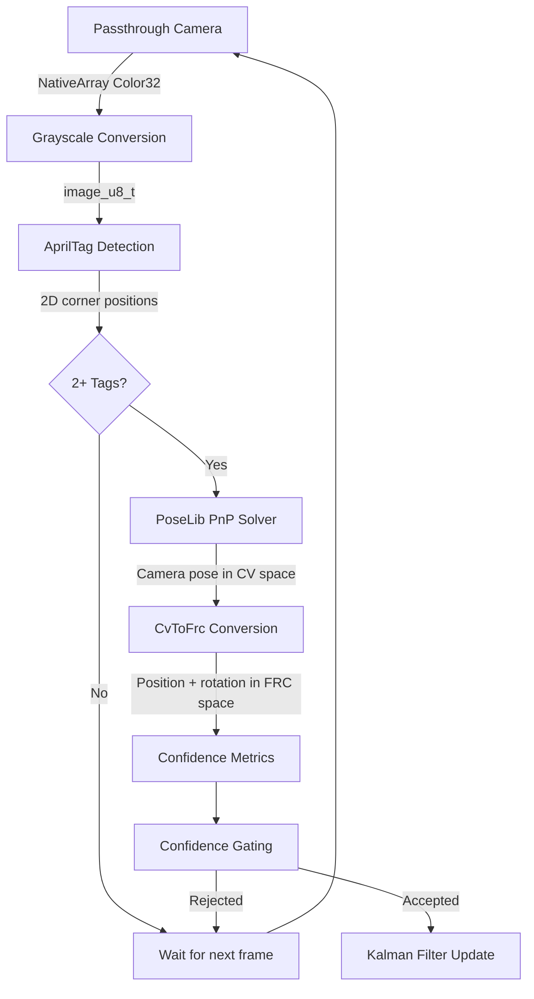

# Detection Pipeline

This page describes the step-by-step process from camera frame capture to a field-relative camera pose estimate.

## Pipeline Overview



## Step 1: Frame Capture

The detection loop runs as a Unity Coroutine (`AprilTagFrameCaptureCoroutine`) at a configurable framerate (default 30 FPS). Each cycle:

1. Records a monotonic timestamp via `Time.time`
2. Calls `PassthroughCameraAccess.GetColors()` to get a `NativeArray<Color32>` (RGBA32) from the Quest's passthrough camera
3. The Meta XR SDK provides camera intrinsics (focal length, principal point) that were captured during initialization

:::note
The "Headset Cameras" app permission must be enabled on the Quest for frame capture to work. Without it, `GetColors()` will throw a `NullReferenceException`.
:::

## Step 2: Grayscale Conversion

The AprilTag detector requires a single-channel grayscale image. `ImageU8.FromPassthroughCamera()` converts the RGBA32 frame using a Burst-compiled parallel job (`GrayscaleConversionJob`) that processes rows in parallel for performance.

The output is a native `image_u8_t` buffer. A static cache is reused across frames — the buffer is only reallocated when the resolution changes.

## Step 3: AprilTag Detection

The grayscale image is passed to the native libapriltag library via `AprilTagDetector.Detect()`. The detector:

1. Searches for tag36h11 fiducial markers in the image
2. Returns an `AprilTagDetectionResults` collection containing, for each detected tag:
   - **Tag ID** — the numeric identifier
   - **Four corner positions** in image pixel coordinates (2D)
   - **Center position** in pixel coordinates
   - **Hamming distance** — error correction metric

:::info
The Meta Quest passthrough camera produces a **mirrored image**. This causes the AprilTag detector to return corners in clockwise order (Bottom-Right, Bottom-Left, Upper-Left, Upper-Right) rather than the standard counter-clockwise convention. The 3D corner positions are intentionally ordered to match this CW convention.
:::

## Step 4: Multi-Tag PnP Solve

If 2 or more tags are detected, `PoseLibSolver.PoseLibSolve()` estimates the camera's 3D pose. This is a Perspective-n-Point (PnP) problem: given 2D image points and their known 3D field positions, find the camera pose.

### Building Correspondences

For each detected tag, the solver collects:

- **2D points**: The four corner positions from the detector (in pixel coordinates)
- **3D points**: The four corner positions from `AprilTagFieldLayout.GetTagCorners()` (in FRC field coordinates, meters)

The 3D corners are computed by applying tag-local offsets (±halfSize in Y and Z) to the tag's field pose from the JSON layout file. In the tag's local frame:
- X = 0 (the tag face plane)
- Y = ±halfSize (left/right on the tag)
- Z = ±halfSize (up/down on the tag)

These are transformed into field coordinates via `tagPose.Plus(cornerTransform)`.

### PoseLib Solver

All 2D-3D correspondences are flattened into arrays and passed to the native PoseLib function `poselib_estimate_absolute_pose_simple()` with:

- **Camera model**: Pinhole (fx, fy, cx, cy from Meta's SDK)
- **Max reprojection error**: 12 pixels
- **Output**: Camera pose as quaternion (W, X, Y, Z) + translation (X, Y, Z), plus an inlier count

PoseLib uses RANSAC internally, meaning it can tolerate some bad correspondences (e.g., from partially occluded tags). The **inlier count** indicates how many of the input point correspondences were consistent with the estimated pose.

### Output Convention

PoseLib returns a **world-to-camera** transform following the COLMAP convention:

```
P_camera = R * P_world + t
```

The "world" here is whatever coordinate system the 3D points are in — which is **FRC field coordinates**. The camera frame uses CV conventions (X-right, Y-down, Z-forward).

## Step 5: CV to FRC Conversion

`Conversions.CvToFrc()` converts PoseLib's world-to-camera output into the camera's position and orientation in FRC field coordinates.

### Position

The camera's position in the field is computed by inverting the world-to-camera transform:

```
C_field = -(R_inv * t)
```

This gives the camera position in FRC field coordinates (meters).

### Orientation

The rotation is converted from CV camera axes to FRC body axes (X-forward, Y-left, Z-up) by composing the inverse rotation with a fixed body rotation:

```
q_FRC = R_inv * q_cv_to_body
```

where `q_cv_to_body = (w=0.5, x=-0.5, y=0.5, z=0.5)`.

See the [Coordinate Systems](./coordinate-systems) page for the full derivation.

## Step 6: Confidence Metrics

Before the observation reaches the Kalman filter, several confidence metrics are computed:

| Metric | Formula | Purpose |
|--------|---------|---------|
| **Inlier ratio** | `AcceptedPoints / TotalPoints` | Fraction of correspondences that PoseLib's RANSAC accepted. Higher = more reliable. |
| **Tag count** | `NumberOfDetections` | More tags provide stronger geometric constraints. |
| **Average tag distance** | `‖position‖` (norm of FRC position vector) | Proxy for camera-to-tag range. Distant tags are less precise. |
| **Dynamic std dev** | `BASE × (avgDist² / tagCount)` | Measurement noise for the Kalman filter. Scales with distance, inversely with tag count. |

The dynamic standard deviation controls how much the Kalman filter trusts each observation:
- **Close + many tags** → low std dev → strong correction
- **Far + few tags** → high std dev → gentle nudge

The Z-axis standard deviation is doubled relative to X and Y, reflecting the lower vertical precision of the PnP solution.

## Step 7: Confidence Gating

The observation is evaluated against phase-dependent thresholds before it can update the Kalman filter. See the [Kalman Filter](./kalman-filter) page for the full two-phase gating logic.

## Timing

The entire pipeline (capture → detect → solve → convert → gate) runs within a single coroutine iteration. The detection framerate is configurable (default 30 FPS), meaning the headset gets up to 30 position correction opportunities per second when AprilTags are visible.

Between AprilTag corrections, the Kalman filter continues to track position using VIO displacement data at 120 Hz, providing smooth dead-reckoning between tag sightings.
