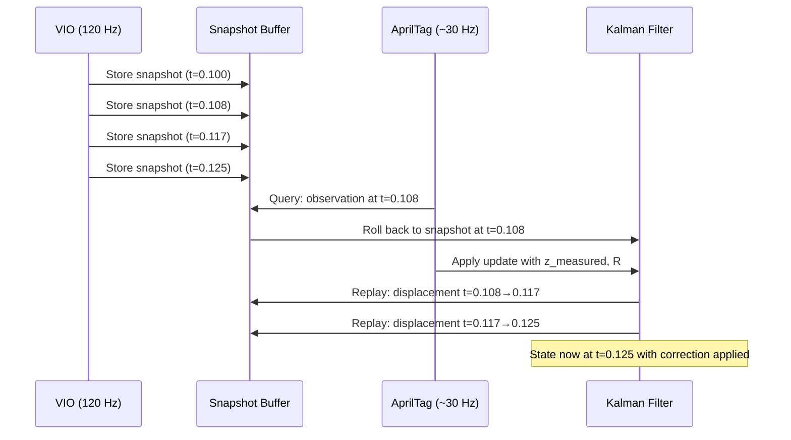

# Kalman Filter & Pose Estimation

QuestNav fuses high-rate Visual-Inertial Odometry (VIO) data from the headset with lower-rate AprilTag observations using a discrete Kalman filter with latency-compensated replay. The design is modeled after WPILib's `SwerveDrivePoseEstimator`.

## State Model

The Kalman filter operates on a **3D position** state vector in FRC field coordinates.

| Parameter | Value | Description |
|-----------|-------|-------------|
| **State vector x** | `[x, y, z]` | 3D position in meters (FRC field frame) |
| **F (state transition)** | 3×3 Identity | Prediction uses explicit displacement, not a velocity model |
| **H (observation)** | 3×3 Identity | AprilTags provide a direct position measurement |
| **Q (process noise)** | `diag(0.02², 0.02², 0.01²)` | VIO displacement uncertainty per step |
| **R (measurement noise)** | Dynamic | Computed per observation; see [Dynamic Measurement Noise](#dynamic-measurement-noise) |
| **P₀ (initial covariance)** | `0.001 × I` | Very high initial confidence in VIO position |

The filter does **not** estimate velocity or rotation — only position. Rotation is handled separately via a yaw offset.

## Prediction Step (120 Hz)

Called by `AddVioObservation(pose, timestamp)` every time the VIO system provides a new headset pose (120 Hz).

### Algorithm

1. **First call only**: Initialize the filter with the current VIO position via `ResetPosition()` and return.

2. **Compute raw displacement**:

$$
d_{raw} = p_{vio}^{current} - p_{vio}^{previous}
$$

Both positions are in the FRC-mapped-from-Unity frame (axes are FRC-labeled but orientation depends on headset startup).

3. **Rotate displacement by yaw offset** to align with the true FRC frame:

$$
d_{corrected} = \begin{bmatrix} \cos(\psi) & -\sin(\psi) & 0 \\ \sin(\psi) & \cos(\psi) & 0 \\ 0 & 0 & 1 \end{bmatrix} d_{raw}
$$

where $\psi$ is the `yawOffset` computed during Phase 1 alignment.

4. **Kalman predict**:

$$
\hat{x}_{k|k-1} = F \hat{x}_{k-1|k-1}
$$

$$
P_{k|k-1} = F P_{k-1|k-1} F^T + Q
$$

5. **Apply displacement** (dead-reckoning correction):

$$
\hat{x}_{k|k-1} \leftarrow \hat{x}_{k|k-1} + d_{corrected}
$$

6. **Reconstruct filter** with the corrected state (the MathNet Kalman filter does not expose state mutation, so a new instance is created).

7. **Store snapshot** in the replay buffer: `(timestamp, vioPosition, vioRotation, kfState)`.

8. **Prune** snapshots older than the buffer duration (default 0.5 seconds).

## Correction Step (~30 Hz)

Called by `AddAprilTagObservation(...)` when an AprilTag observation passes confidence gating.

### Two-Phase Gating

Observations must pass phase-dependent quality gates before updating the filter.

#### Phase 1: Initial Alignment

Before any accepted AprilTag observation, the Kalman filter runs on pure VIO in an arbitrary coordinate frame. The first observation meeting the minimum quality bar establishes the field alignment.

**Gate conditions:**
- `tagCount >= 2`
- `inlierRatio >= 0.6`

**On accept:**
1. **Hard-reset the KF state** to the measured AprilTag position:

$$
\hat{x} \leftarrow z_{measured}
$$

This bypass is necessary because the initial covariance $P_0 = 0.001 \times I$ represents extreme confidence in the VIO starting position. A standard Kalman update would compute a near-zero gain:

$$
K = P H^T (H P H^T + R)^{-1} \approx \frac{0.001}{0.001 + R} \approx 0.004
$$

This would cause the filter to almost entirely ignore the first AprilTag measurement, keeping the headset stuck near its VIO origin.

2. **Set covariance** to the observation's measurement noise:

$$
P \leftarrow \text{diag}(\sigma_{x}^{2},\ \sigma_{y}^{2},\ \sigma_{z}^{2})
$$

3. **Clear and re-seed** the snapshot buffer with the current VIO baseline and new KF state.

4. **Compute yaw correction** (see [Yaw Correction](#yaw-correction) below).

5. Set `hasInitialAlignment = true` → transition to Phase 2.

**On reject:** Observation discarded.

#### Phase 2: Confidence-Gated Corrections

After initial alignment, VIO is the primary pose source. AprilTag corrections are applied only if they meet strict quality requirements.

**Gate conditions (all must pass):**
- Position jump: `‖z_measured − x̂_current‖ < 2.0m`
- `tagCount >= 3`
- `inlierRatio >= 0.8`

**On accept:** Standard KF update with latency compensation (see below). No yaw update.

**On reject:** Observation discarded.

### Standard KF Update (Phase 2)

When a Phase 2 observation is accepted:

$$
K = P_{k|k-1} H^T (H P_{k|k-1} H^T + R)^{-1}
$$

$$
\hat{x}_{k|k} = \hat{x}_{k|k-1} + K(z - H \hat{x}_{k|k-1})
$$

$$
P_{k|k} = (I - KH) P_{k|k-1}
$$

where $z$ is the AprilTag-measured position and $R$ is the dynamic measurement noise.

### Latency Compensation (Replay Buffer)

AprilTag observations are processed with a non-trivial delay relative to when the frame was captured. To account for this, the estimator maintains a rolling buffer of VIO snapshots and uses them to replay state corrections.

#### Algorithm

1. **Find the matching snapshot** — search backwards through the buffer for the latest snapshot with `timestamp <= aprilTagTimestamp`.

2. **If a match is found:**
   - Roll the KF state back to the snapshot's stored state
   - Apply the KF update at that historical point
   - **Replay forward**: re-apply all subsequent VIO displacements (each rotated by the current yaw offset) to bring the state to the present
   - Update each replayed snapshot's stored state in-place

3. **If no match is found** (observation is very recent or buffer is empty):
   - Apply the KF update directly to the current state (no replay)

## Yaw Correction

The Kalman filter handles position. Yaw (heading) is corrected separately via a scalar offset that is computed **once** during Phase 1 and then locked.

### Computing the Yaw Offset

When the first accepted AprilTag observation arrives (Phase 1):

1. Extract the **measured yaw** from the AprilTag rotation:

$$
\psi_{measured} = \text{Rotation3d.Z}(q_{aprilTag})
$$

The `.Z` component of a `Rotation3d` corresponds to rotation around the FRC Z-axis (up), which is yaw.

2. Look up the **VIO yaw at capture time** from the snapshot buffer (or fall back to the latest VIO rotation if no match):

$$
\psi_{vio} = \text{Rotation3d.Z}(q_{vioAtCapture})
$$

3. Compute the offset:

$$
yawOffset = \text{normalize}(\psi_{measured} - \psi_{vio})
$$

where `normalize` wraps the result to $[-\pi, \pi]$.

### Applying the Yaw Offset

The yaw offset is applied in two places:

1. **VIO displacements** in `AddVioObservation` and during replay — rotated by the offset before being added to the KF state.

2. **Output rotation** in `EstimatedPose`:

$$
q_{output} = q_{latestVio} \circ R_z(yawOffset)
$$

where $R_z$ is a rotation around the Z-axis and $\circ$ denotes quaternion composition.

### Why Yaw Is Locked After Phase 1

Continuing to update yaw from AprilTag measurements would be susceptible to noisy or erroneous observations (reflections, partial occlusions). The Quest headset's VIO provides excellent short-term rotational tracking with minimal drift. By locking the yaw offset after the initial alignment, the system leverages VIO's rotational stability while using AprilTags only for the initial frame alignment.

:::info
Only yaw (rotation around Z) is corrected. Pitch and roll pass through directly from VIO unfiltered. The Quest's IMU and VIO are sufficiently accurate for pitch and roll in FRC applications.
:::

## Dynamic Measurement Noise

The Kalman filter's R matrix is computed dynamically for each AprilTag observation, scaling the measurement noise based on observation quality.

### Formula

$$
\sigma_{linear} = \sigma_{base} \times \frac{d_{avg}^{2}}{n_{tags}}
$$

where:
- $\sigma_{base}$ = 0.05 m (compile-time constant `MULTI_TAG_LINEAR_STD_DEV_BASE`)
- $d_{avg}$ = average distance to tags (approximated as `‖position‖`)
- $n_{tags}$ = number of detected tags

The R matrix is then:

$$
R = \text{diag}(\sigma_{linear}^{2},\ \sigma_{linear}^{2},\ (2\sigma_{linear})^{2})
$$

The Z-axis noise is doubled because vertical position is less precisely determined by the PnP solution (tags are typically at similar heights, providing weak vertical constraints).

### Effect on Filter Behavior

| Scenario | σ_linear | Kalman Gain | Behavior |
|----------|----------|-------------|----------|
| 3 tags at 2m | 0.067m | High | Strong correction |
| 5 tags at 3m | 0.090m | Moderate | Moderate correction |
| 2 tags at 5m | 0.625m | Low | Gentle nudge |

## Recenter Handling

When the user presses and holds the Quest logo button, the Meta Quest headset **recenters** the VIO tracking origin. This causes a discontinuous jump in `centerEyeAnchor.position`, which would produce a massive fake displacement in the next `AddVioObservation` call and corrupt the KF state.

QuestNav listens for the `OVRManager.display.RecenteredPose` event and calls `HandleRecenter()`, which:

1. Updates `previousVioPosition` to the new VIO position (so the next displacement computes as zero)
2. Updates `latestRotation` to the new VIO rotation
3. Clears the snapshot buffer and re-seeds it with the current KF state
4. **Preserves**: `yawOffset`, `hasInitialAlignment`, KF state, and KF covariance

The key insight is that the headset hasn't actually moved — only the VIO coordinate frame has changed. The Kalman filter's field-relative state remains valid.

## Output

The `EstimatedPose` property returns a `Pose3d` combining:

- **Position**: KF-filtered `[x, y, z]` in FRC field coordinates
- **Rotation**: Latest VIO rotation with yaw offset applied

$$
\text{EstimatedPose} = \text{Pose3d}\big(\hat{x}[0],\ \hat{x}[1],\ \hat{x}[2],\ q_{vio} \circ R_z(yawOffset)\big)
$$

This is published to NetworkTables at 120 Hz for consumption by the robot's drive code.

## Summary of Constants

| Constant | Value | Description |
|----------|-------|-------------|
| `VIO_POSITION_STD_DEV_X` | 0.02 m | Process noise, X |
| `VIO_POSITION_STD_DEV_Y` | 0.02 m | Process noise, Y |
| `VIO_POSITION_STD_DEV_Z` | 0.01 m | Process noise, Z |
| `MULTI_TAG_LINEAR_STD_DEV_BASE` | 0.05 m | Base measurement noise |
| `INITIAL_ALIGNMENT_MIN_TAGS` | 2 | Min tags for Phase 1 |
| `INITIAL_ALIGNMENT_MIN_INLIER_RATIO` | 0.6 | Min inlier ratio for Phase 1 |
| `CORRECTION_MIN_TAGS` | 3 | Min tags for Phase 2 |
| `CORRECTION_MIN_INLIER_RATIO` | 0.8 | Min inlier ratio for Phase 2 |
| `CORRECTION_MAX_POSITION_JUMP` | 2.0 m | Max position jump for Phase 2 |
| `SNAPSHOT_BUFFER_DURATION` | 0.5 s | Replay buffer duration |
